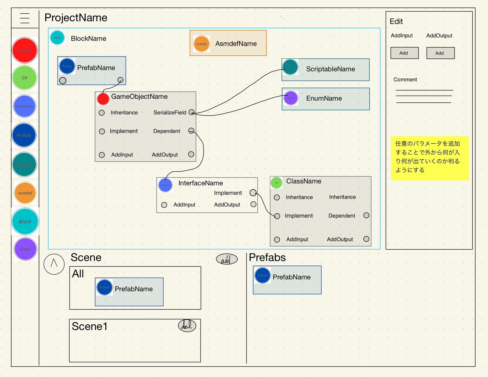
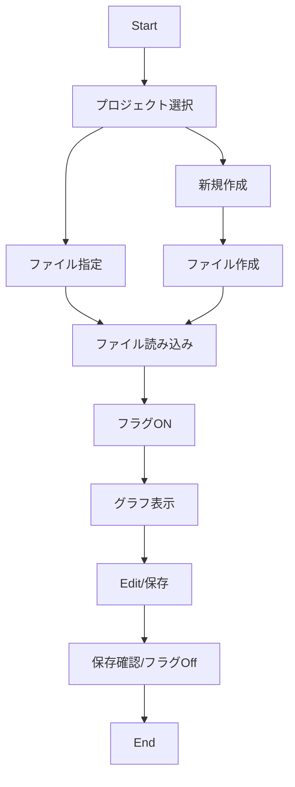

# 要求/要件

**要求/要件**
- 設計できる
- テキストとして保存/読み出し
- 設計後にブロックのioをまとめて表示できる
- (低)xml付きのスクリプト自動生成

**設計ステップ**
- まず何がUnityの世界に露出するか考えてGameObjectを決める
- 細かい機能などを分割したり、util系のクラスをpureとして定義していく
- GameObjectのシリアライズフィールドなどの参照情報を明記していく
- ブロックを決める(一言で何をするとこか書く、名前空間名を付ける)
- ブロックの依存関係を決める
- prefab化
- シーンの定義★これは好きなタイミングで
- どのオブジェクトをどのシーンに置くか整理する
- asmdefを設定

# 画面イメージ
ノードベースの描画を想定  

# シーケンス図

