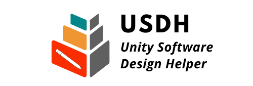

<div align="center">

</div>

# USDH(Unity Software Design Helper)

Unity特有の概念に対応した設計支援ツール  

# DEMO

"hoge"の魅力が直感的に伝えわるデモ動画や図解を載せる
TBD

# Features

Unity特有の以下の概念に対応したソフト設計ツール。
- Scene
- GameObject
- asmdef/asmref
- ScriptableObject

設計方針をツール側で既定することで一貫した作りのソフトウェアを常に作成可能となる。  
※本ツールで用いている設計指針は作成者の独断で決定している。

# Requirement

"hoge"を動かすのに必要なライブラリなどを列挙する

* huga 3.5.2
* hogehuga 1.0.2
TBD

# Installation

Requirementで列挙したライブラリなどのインストール方法を説明する

```bash
pip install huga_package
```
TBD

# Usage

DEMOの実行方法など、"hoge"の基本的な使い方を説明する

```bash
git clone https://github.com/hoge/~
cd examples
python demo.py
```
TBD

# Note

注意点などがあれば書く
TBD

# Author

* Gyabi

# License

"hoge" is under [Apache license](http://www.apache.org/licenses/).